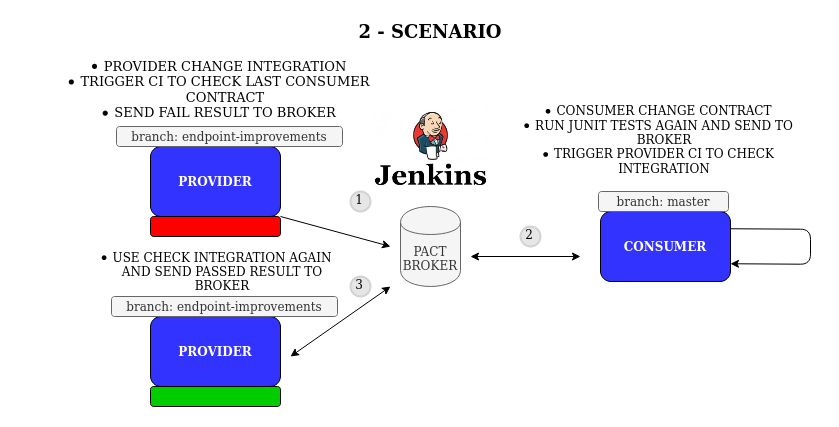

# PACT CI WORKSHOP

This repository is an example to how implement PACT consumer driver contract and automatically verify if any integration is broken.

## Tools Used

 - Jenkins
 - Postgresql
 - Pact Broker

 Table of contents
=================

<!--ts-->
   * [Pact concept](#Pact-concept)
   * [Pact Workflow](#Pact-Workflow)
   * [Scenarios](#Scenarios)
      * [First Scenario](#First-Scenario)
      * [Second Scenario](#Second-Scenario)
      * [Third Scenario](#Third-Scenario)

<!--te-->

## Pact concept

Pact is a code-first tool for testing HTTP and message integrations using contract tests. Contract tests assert that inter-application messages conform to a shared understanding that is documented in a contract. Without contract testing, the only way to ensure that applications will work correctly together is by using expensive and brittle integration tests.
Do you set your house on fire to test your smoke alarm? No, you test the contract it holds with your ears by using the testing button. Pact provides that testing button for your code, allowing you to safely confirm that your applications will work together without having to deploy the world first.

## Pact Workflow 

We have two independent repositories here, to simulate an development environment, this two repositories can be found on my github.

 - client-api (consumer) https://github.com/vinirib/pact-consumer-sample

  - account-api (provider) https://github.com/vinirib/pact-provider-sample

To make the automation were you can see on the picture the steps are.
 When you up jenkins in docker, automatically will create the necessary jobs, will be tree steps.

 1 - Jenkins will download repository and run a custom jenkins file to package maven project and generate contracts, this contracts will be send to the pact broker.

 2 - If the previous job is successful, this second job will be called, and call the provider repository, download and run junit tests where junit tests will be validate contracts.

 3 -  If the previous job is successful, Jenkins will call the last job can-i-deploy, this is a pact tool that will verify if this integration is ok, if all responses is ok, you will see all jobs result OK in jenkins after all.

## Scenarios

On this repository we will see tree scenarios, on this scenarios we will describe the most common interactions you can combine with Pact Broker and Jenkins with your contract integration tests.

### First Scenario
[Branch Master] (https://github.com/vinirib/pact-ci-workshop#Scenarios)

On this first scenario we have the basic flow. Consumer created an code to make the integration call, and created the consumer contract test with Pact framework, but, in this case, we have some jenkinsfile on consumer repository to run CI events to run the tests, generate contract and publish on our Pact Broker (in container).

Next, if this Jenkins stage was done successful, we will call the next job, this will run provider junit tests and see if the contract integration was right (by provider side).

If all works done, the final job will trigger another jenkinsfile to run can-i-deploy to see if this integration result was successful or failed.

### Second Scenario

[Branch feature/provider-changed-contract] (https://github.com/vinirib/pact-ci-workshop/tree/feature/provider-changed-contract)

The second scenario, provider was maked some changes on the endpoint of consumer call (without advice), when they trigger CI, the pact contracts will be break

### Third Scenario

[Branch feature/consumer-make-some-changes] (https://github.com/vinirib/pact-ci-workshop/tree/feature/consumer-make-some-changes)

The third scenario, consumer was maked some improvements and trigger CI to see if have some changes on integration, but, for our suprise, provider makes some change again withou advice and CI will break again

